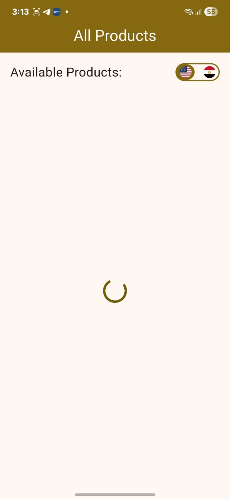
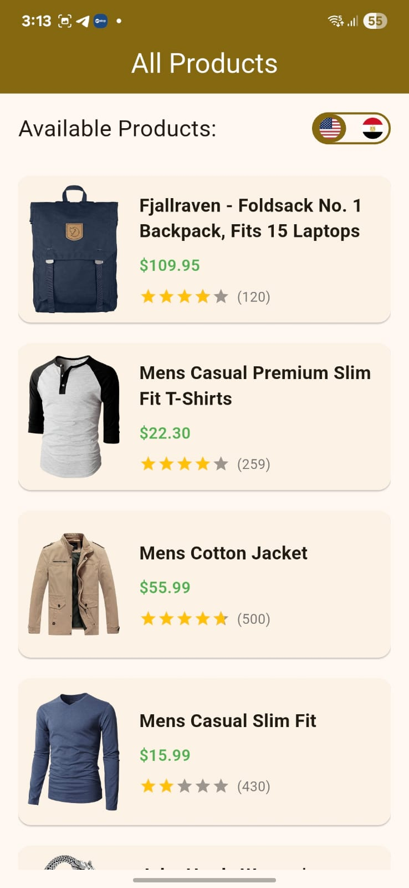
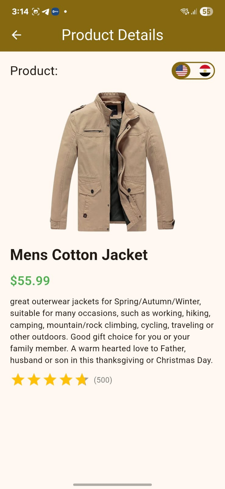
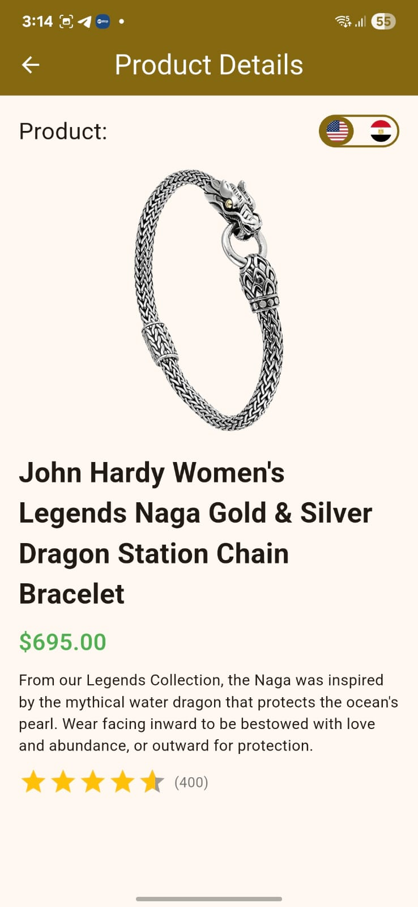

# Flutter Product Catalog Mini App

A modern Flutter application demonstrating clean architecture, state management, and responsive design principles. This app showcases a product catalog with multilingual support and professional UI/UX implementation.

## 📱 Features

### Core Functionality

- **Product Catalog**: Browse products from a REST API
- **Product Details**: View detailed product information
- **Responsive Design**: Optimized for both Android and iOS
- **Multilingual Support**: English and Arabic languages with RTL support
- **Clean Architecture**: Organized with separation of concerns
- **State Management**: Cubit state handling with loading, success, and error states

## 🏗️ Architecture

This project follows **Clean Architecture** principles with clear separation of layers:

```
lib/
├── core/                     # Core functionality and utilities
│   ├── di/                   # Dependency injection setup
│   ├── routing/              # Navigation and routing
│   ├── utils/                # Utility functions and constants
│   ├── themes/               # App themes and styling
│   └── localization/         # Internationalization files
├── features/                 # Feature modules
│   ├── splash/
│   │   ├── data/            # Data sources and repositories
│   │   ├── logic/           # Business logic (Cubit)
│   │   └── ui/              # UI components and screens
│   ├── onboarding/
│   ├── products/
│   └── product_details/
└── main.dart                # App entry point
```

### Architecture Layers

1. **Data Layer**: Handles API calls, data models, and repositories
2. **Domain Layer**: Contains business logic implemented with Cubit
3. **Presentation Layer**: Manages user interface and user interactions

## 🛠️ Technologies & Packages

### Core Dependencies

```yaml
dependencies:
  flutter_native_splash: ^2.4.6
  flutter_screenutil: ^5.9.3
  easy_localization: ^3.0.8
  go_router: ^16.1.0
  internet_connection_checker: ^3.0.1
  country_flags: ^3.3.0
  animated_toggle_switch: ^0.8.5
  dio: ^5.9.0
  pretty_dio_logger: ^1.4.0
  retrofit: ^4.7.1
  dartz: ^0.10.1
  get_it: ^8.2.0
  bloc: ^9.0.0
  flutter_bloc: ^9.1.1
  meta: ^1.16.0
  flutter_rating_bar: ^4.0.1
  cached_network_image: ^3.4.1
```

### Development Dependencies

```yaml
dev_dependencies:
  flutter_test: ^3.x.x
  flutter_lints: ^3.x.x # Linting rules
  build_runner: ^2.x.x # Code generation
```

## 🚀 Getting Started

### Prerequisites

- Flutter SDK (^3.0.0)
- Dart SDK (^3.0.0)
- Android Studio / VS Code
- Android SDK / Xcode (for iOS)

### Installation

1. **Clone the repository**

   ```bash
   git clone https://github.com/yara30999/product_catalog_task.git
   cd product_catalog_task
   ```

2. **Install dependencies**

   ```bash
   flutter pub get
   ```

## 🌐 API Integration

The app integrates with the [Fake Store API](https://fakestoreapi.com/) for product data:

- **Base URL**: `https://fakestoreapi.com`
- **Products Endpoint**: `/products`

## 🎨 UI/UX Design

 <div style="display: flex; gap: 10px;">
    
    
    
    
 </div>
 <div style="display: flex; gap: 10px;">
    
    
    
    
 </div>
